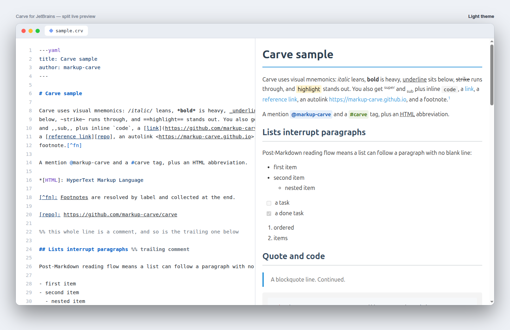
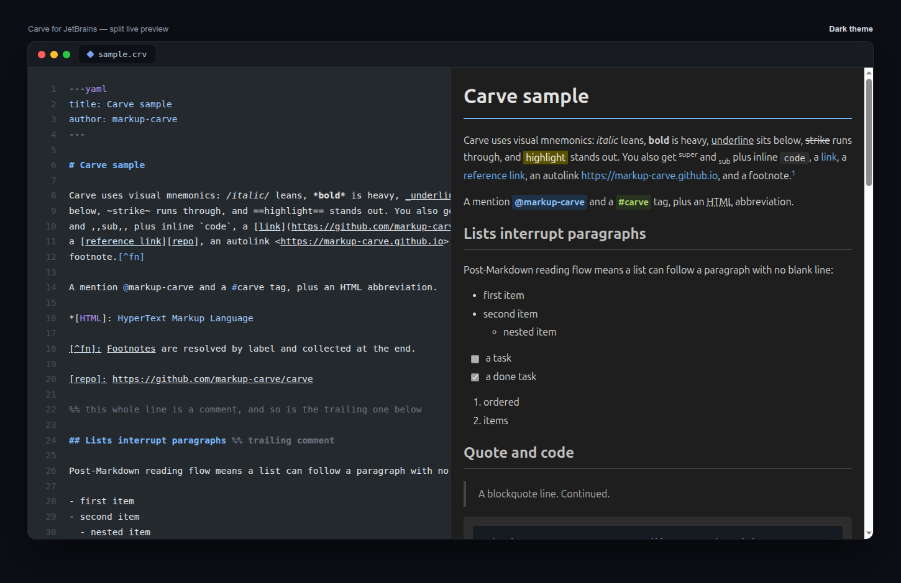
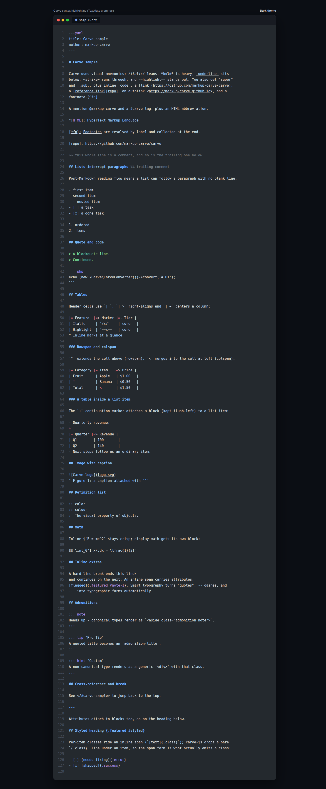

# intellij-carve

[](https://plugins.jetbrains.com/plugin/32204-carve)
[](https://plugins.jetbrains.com/plugin/32204-carve)
[](https://github.com/markup-carve/intellij-carve/actions/workflows/build.yml)
[](LICENSE)

Carve markup language support for JetBrains IDEs (IntelliJ IDEA, PhpStorm,
WebStorm, PyCharm, GoLand, RubyMine, Rider, and the rest of the family).

## Features

- **Syntax highlighting** via TextMate grammar (shared with
  [vscode-carve](https://github.com/markup-carve/vscode-carve))
- **Language Server features** via the bundled
  [carve-lsp](https://github.com/markup-carve/carve-lsp) server (through
  [LSP4IJ](https://plugins.jetbrains.com/plugin/23257-lsp4ij)):
  - **Diagnostics** - Djot/Markdown migration warnings (with quick fixes) and
    semantic lint (broken cross-references, duplicate heading ids)
  - **Completion** - context-aware suggestions
  - **Code folding** for headings, blocks, and other foldable regions
  - **Structure view + breadcrumbs** - a heading outline of the document
  - **Quick fixes / intentions** - convert Djot/Markdown delimiters to Carve
    (for example `**bold**` to `*bold*`, `_em_` to `/em/`, `{=x=}` to `==x==`)
  - **Hover** documentation
  - **Rename** refactoring
  - **Reformat Code** (document formatting)
  - **Semantic highlighting** (semantic tokens)
  - **Code lenses** - footnote reference counts
- **Live preview** panel (split editor view)
- **IDE theme sync** - preview follows dark/light mode
- **Code highlighting** in preview code blocks (highlight.js)
- **Export to HTML**
- **Live templates** for Carve's visual mnemonics (type `c` + `Tab`)
- **File type** recognition for `.crv` and `.carve`

## Screenshots

**Live preview** - a split editor with Carve source on the left and the rendered HTML on the right:



**Theme sync** - the preview follows the IDE's dark/light mode:



**Syntax highlighting** - via the shared Carve TextMate grammar, including the visual mnemonics, tables, captions, admonitions, and math:



## Requirements

- JetBrains IDE 2024.3+
- Java 17+
- [LSP4IJ](https://plugins.jetbrains.com/plugin/23257-lsp4ij) plugin (installed
  automatically as a dependency)
- **Node.js** on your `PATH` (or configured in **Settings | Tools | Carve**) for
  the language-server features (diagnostics, completion, folding, outline, code
  actions). Syntax highlighting and preview work without Node.js; if Node.js is
  missing, the plugin shows a notification and the LSP features stay disabled
  instead of failing.

## Installation

### From disk (manual)

1. Download the latest release from
   [GitHub Releases](https://github.com/markup-carve/intellij-carve/releases),
   or build it yourself (see [docs/development.md](docs/development.md)).
2. In your IDE: **Settings → Plugins → ⚙️ → Install Plugin from Disk**.
3. Select the `intellij-carve-*.zip` file (in `build/distributions/` if built locally).
4. Restart the IDE.

## Usage

1. Open any `.crv` or `.carve` file - the editor opens in split view (source + preview).
2. The preview updates live as you type.
3. Right-click for **Export to HTML**.
4. Press `Ctrl+Shift+D` to toggle the Carve preview tool window.

## Live Templates

Type a prefix and press `Tab` to expand:

| Prefix | Expands to |
|--------|------------|
| `ch1`-`ch6` | Headings |
| `cb`, `ci`, `cbi` | Bold `*…*`, italic `/…/`, bold-italic `/*…*/` |
| `cu`, `cs`, `chl` | Underline `_…_`, strike `~…~`, highlight `=…=` |
| `csup`, `csub`, `cc` | Superscript `^…^`, subscript `,…,`, inline code |
| `clink`, `cimg` | Link, image |
| `cref`, `cwiki` | Cross-reference `</#id>`, implicit heading ref `[[Heading]]` |
| `ccode`, `cquote`, `chr` | Fenced code block, blockquote, thematic break |
| `cul`, `col`, `ctask`, `ctable` | Lists and table |
| `cdiv` | Div / admonition `::: name` |
| `cmath`, `cmathb` | Inline / display math |
| `ccomment`, `ccommentb`, `cfront` | Line comment, block comment, frontmatter |

## Preview Rendering

Configurable via **Settings → Tools → Carve**:

- **carve-js (default)** - the bundled `@markup-carve/carve` renderer runs on
  GraalJS. No dependencies required.
- **carve-php (PHP CLI)** - renders via
  [markup-carve/carve-php](https://github.com/markup-carve/carve-php). Requires
  PHP and `composer require markup-carve/carve-php` in your project; uses
  `vendor/bin/carve` when present.

### Custom preview CSS

Style the preview with your own CSS. It is injected **after** the built-in
styles, so rules of equal specificity override the defaults (the built-in
type-specific and dark-mode rules use higher specificity - match it or use
`!important` to win).

Sources are concatenated in this order (last wins):

1. `carve-preview.css` next to the open file
2. `carve-preview.css` in the project root, or `.carve/preview.css`
3. the **Custom CSS file** set in *Settings → Tools → Carve → Preview Styling*

Example `carve-preview.css`:

```css
body { font-family: Georgia, serif; }
.admonition.note { background: #eef; }
```

## About Carve

[Carve](https://github.com/markup-carve/carve) is a post-Markdown lightweight
markup language that builds on Djot with visual mnemonics - syntax that looks
like its output (`/italic/`, `*bold*`, `_underline_`, `~strike~`,
`=highlight=`) - plus a Markdown-like reading flow.

## Development

Building, the bundled renderer, grammar updates, and the release process are
documented in [docs/development.md](docs/development.md).

## License

[MIT](LICENSE)
