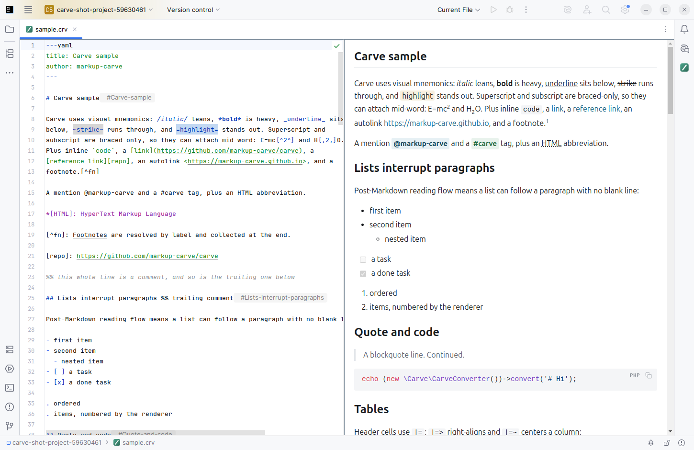
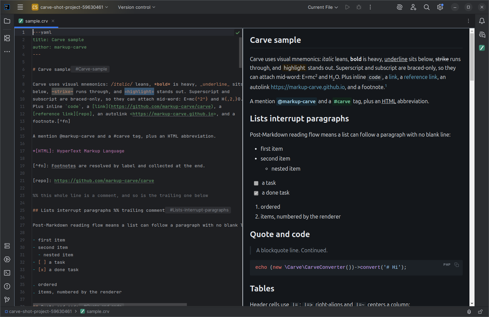
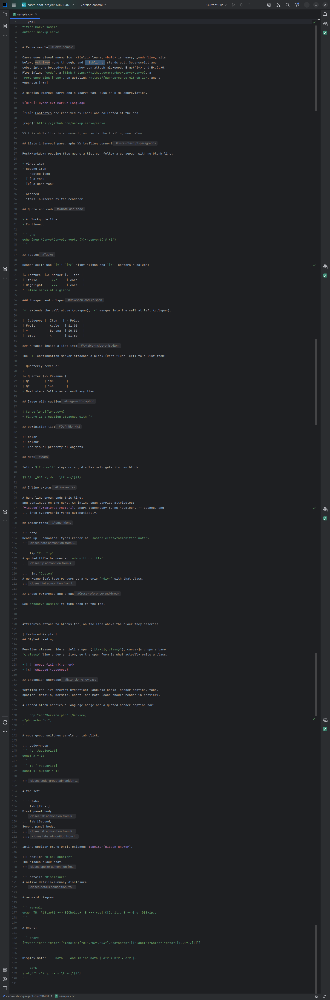

# intellij-carve

[](https://plugins.jetbrains.com/plugin/32204-carve)
[](https://plugins.jetbrains.com/plugin/32204-carve)
[](https://github.com/markup-carve/intellij-carve/actions/workflows/build.yml)
[](LICENSE)

Carve markup language support for JetBrains IDEs (IntelliJ IDEA, PhpStorm,
WebStorm, PyCharm, GoLand, RubyMine, Rider, and the rest of the family).

## Features

- **Syntax highlighting** via TextMate grammar (shared with
  [vscode-carve](https://github.com/markup-carve/vscode-carve))
- **Language Server features** via the bundled
  [carve-lsp](https://github.com/markup-carve/carve-lsp) server (through
  [LSP4IJ](https://plugins.jetbrains.com/plugin/23257-lsp4ij)):
  - **Diagnostics** - Djot/Markdown migration warnings (with quick fixes) and
    semantic lint (broken cross-references, duplicate heading ids)
  - **Completion** - context-aware suggestions
  - **Code folding** for headings, blocks, and other foldable regions
  - **Structure view + breadcrumbs** - a heading outline of the document
  - **Quick fixes / intentions** - convert Djot/Markdown delimiters to Carve
    (for example `**bold**` to `*bold*`, `_em_` to `/em/`, `{=x=}` to `==x==`)
  - **Hover** documentation
  - **Rename** refactoring
  - **Reformat Code** (document formatting)
  - **Semantic highlighting** (semantic tokens)
  - **Code lenses** - footnote reference counts
- **Live preview** panel (split editor view)
- **IDE theme sync** - preview follows dark/light mode
- **Code highlighting** in preview code blocks (highlight.js), with a copy button on each
- **Works offline** - the preview makes no network request of any kind
- **Export to HTML** and **Export to Markdown**
- **Import Markdown or HTML as Carve** - converts a `.md` or `.html` file to a `.crv` beside it
- **Export Bundle** - the document plus every file it includes, as a folder beside it
- **Live templates** for Carve's visual mnemonics (type `c` + `Tab`)
- **File type** recognition for `.crv`

## Screenshots

**Live preview** - a split editor with Carve source on the left and the rendered HTML on the right:



**Theme sync** - the preview follows the IDE's dark/light mode:



**Syntax highlighting** - via the shared Carve TextMate grammar, including the visual mnemonics, tables, captions, admonitions, and math:



## Requirements

- JetBrains IDE 2025.1+
- Java 17+
- [LSP4IJ](https://plugins.jetbrains.com/plugin/23257-lsp4ij) plugin — **optional**.
  The plugin loads with syntax highlighting, live preview, HTML export and live
  templates without it. Install LSP4IJ (from the Marketplace) to enable the
  language-server features below. Installing Carve from the Marketplace offers to
  install LSP4IJ alongside it.
- **Node.js** on your `PATH` (or configured in **Settings | Tools | Carve**) for
  the language-server features (diagnostics, completion, folding, outline, code
  actions) — these also require LSP4IJ. Syntax highlighting and preview work
  without Node.js or LSP4IJ; if Node.js is missing, the plugin shows a
  notification and the LSP features stay disabled instead of failing.

## Installation

### From disk (manual)

1. Download the latest release from
   [GitHub Releases](https://github.com/markup-carve/intellij-carve/releases),
   or build it yourself (see [docs/development.md](docs/development.md)).
2. In your IDE: **Settings → Plugins → ⚙️ → Install Plugin from Disk**.
3. Select the `intellij-carve-*.zip` file (in `build/distributions/` if built locally).
4. Restart the IDE.

## Usage

1. Open any `.crv` file - the editor opens in split view (source + preview).
2. The preview updates live as you type.
3. Right-click for **Export to HTML**.
4. Press `Ctrl+Shift+D` to toggle the Carve preview tool window.

## Importing Markdown and HTML

Right-click a `.md` or `.html` file in the Project view, or open it and use
**Tools > Import Markdown as Carve** (**Import HTML as Carve** for an HTML
file). The bundled engine converts it (`markdownToCarve` / `htmlToCarve`),
formats the result the way `carve fmt` would, writes a `.crv` file with the
same base name beside it, and opens it. If that
file already exists, the plugin asks before overwriting it. The action is only
shown for `.md`, `.markdown`, `.html` and `.htm` files.

When LSP4IJ is installed, the plugin tells the language server to hide its own
*Export as Markdown/HTML* source actions (`exportActions: false`), so export is
not offered twice next to the plugin's export actions.

## Live Templates

Type a prefix and press `Tab` to expand:

| Prefix | Expands to |
|--------|------------|
| `ch1`-`ch6` | Headings |
| `cb`, `ci`, `cbi` | Bold `*…*`, italic `/…/`, bold-italic `/*…*/` |
| `cu`, `cs`, `chl` | Underline `_…_`, strike `~…~`, highlight `=…=` |
| `csup`, `csub`, `cc` | Superscript `{^…^}`, subscript `{,…,}`, inline code |
| `clink`, `cimg` | Link, image |
| `cref`, `cwiki` | Cross-reference `</#id>`, implicit heading ref `[[Heading]]` |
| `ccode`, `cquote`, `chr` | Fenced code block, blockquote, thematic break |
| `cul`, `col`, `ctask`, `ctable` | Lists and table |
| `cdiv` | Div / admonition `::: name` |
| `cmath`, `cmathb` | Inline / display math |
| `ccomment`, `ccommentb`, `cfront` | Line comment, block comment, frontmatter |

## Preview Rendering

Configurable via **Settings → Tools → Carve**:

- **carve-js (default)** - the bundled `@markup-carve/carve` renderer runs on
  GraalJS. No dependencies required.
- **carve-php (PHP CLI)** - renders via
  [markup-carve/carve-php](https://github.com/markup-carve/carve-php). Requires
  PHP and `composer require markup-carve/carve-php` in your project; uses
  `vendor/bin/carve` when present.

### Offline, and no outbound requests

The preview loads nothing from the internet. highlight.js, Chart.js, MathJax and
Mermaid ship inside the plugin and are read from disk, so code colours, charts,
math and diagrams render the same on a plane as on a desk - and opening a `.crv`
file never tells anyone that you did.

| Package | Version | Licence |
| --- | --- | --- |
| [highlight.js](https://github.com/highlightjs/highlight.js) (+ its github / github-dark themes) | 11.9.0 | BSD-3-Clause |
| [Chart.js](https://github.com/chartjs/Chart.js) | 4.5.1 | MIT |
| [MathJax](https://github.com/mathjax/MathJax) | 3.2.2 | Apache-2.0 |
| [Mermaid](https://github.com/mermaid-js/mermaid) | 11.17.2 | MIT |

Each package's licence text ships beside its files in
`src/main/resources/preview-assets/`, and the versions and provenance are
recorded in `preview-assets/VENDOR.md`.

*Export to HTML is deliberately different*: an exported file is meant to be
opened and shared anywhere, so it cannot point at a path on the machine that
produced it. It inlines highlight.js, the Carve grammar and the light theme
(about 230 KB), so code blocks, Carve fences and `{.diff}` fences look the same
as in the preview with no network. MathJax is still linked from a CDN.

### Copying code

Every code block carries a copy button next to its language name. It copies
through the IDE, so the text lands on the same clipboard the editor pastes from,
and the button turns green (or red) for a moment so a copy that did not happen
is never silent.

### Container recipes

`::: name` is core syntax that is always on, and a word with no registered
handler renders as a generic `<div class="name">`. The preview ships the
[carve-css](https://github.com/markup-carve/carve-css) recipes layer, so those
constructs are styled here without any configuration:

```
::: tree
- src/
  - parser/
    - blocks.crv
- tests/
:::
```

renders as a drawn tree rather than a bare nested list. Also covered:
`::: cards`, `::: columns`, `::: gallery`, `::: steps`, `::: aside`,
`::: scroll`, `::: wide`, `{.lead}` on a paragraph, `[text]{.badge}`, and table
modifiers including per-row status (`{.ok}`, `{.warn}`, `{.fail}` on a row's
closing pipe).

Several take a `data-*` attribute instead of a second class - `data-guides`,
`data-columns`, `data-tone` - and every value resolves through a `--carve-*`
custom property, so your own preview CSS can retune one without overriding a
selector.

### Custom preview CSS

Style the preview with your own CSS. It is injected **last** - after the
built-in styles and after the carve-css layers above - so rules of equal
specificity override both (the built-in type-specific and dark-mode rules use
higher specificity - match it or use `!important` to win).

Sources are concatenated in this order (last wins):

1. `carve-preview.css` next to the open file
2. `carve-preview.css` in the project root, or `.carve/preview.css`
3. the **Custom CSS file** set in *Settings → Tools → Carve → Preview Styling*

Example `carve-preview.css`:

```css
body { font-family: Georgia, serif; }
.admonition.note { background: #eef; }
```

## Includes

A `{{ path }}` directive pulls another Carve file into this one (spec PART 9
&sect; 19). The bundled language server resolves them, which gives you
go-to-definition from the directive into the included file, path completion as
you type one, the child file's headings in the Structure view, and a warning
where a target does not resolve - instead of a line that looks like ordinary
prose.

Configurable under **Settings → Tools → Carve → Includes**:

| Setting | Values | Default | What it does |
| --- | --- | --- | --- |
| Resolve includes | In trusted projects / Always / Never | In trusted projects | Follows the IDE's project trust. An untrusted project resolves nothing, which is what &sect; 19 asks for. |
| Containment root | a folder, or empty | empty | No include may resolve outside this folder. Empty means the project root, falling back to the document's own directory - never the IDE's working directory. |

Both are read by the language server when it starts, so changing either
restarts it.

### Export Bundle

Right-click a `.crv` file and choose **Export Bundle (Document and Its
Includes)**. The plugin writes the document and every file it reaches into a
`<name>.bundle` folder beside it, laid out relative to the containment root so
the directives keep resolving inside the copy. Targets it could not read are
reported by name rather than silently left out.

This is the shape for "send it to a colleague who will keep editing it": the
`{{ }}` directives survive, so what arrives is still a document rather than one
long file.

The files are COPIED, not merged. Flattening - one self-contained `.crv`, and
its clipboard twin - is the other half of this feature and is not reachable
yet; so is expanding includes in the preview. Both need the engine's expansion
pass, and although carve-js has had one on `main` since
markup-carve/carve-js#1694, no published release carries it: nothing in the
`dist` of `@markup-carve/carve@0.1.6`, the newest on npm, mentions
`expandIncludes`. The plugin vendors its engine twice - the preview bundle and
the copy inside the language server - and both are pinned to one published
carve-js revision on purpose, so neither can move ahead of a release.

## About Carve

[Carve](https://github.com/markup-carve/carve) is a post-Markdown lightweight
markup language that builds on Djot with visual mnemonics - syntax that looks
like its output (`/italic/`, `*bold*`, `_underline_`, `~strike~`,
`=highlight=`) - plus a Markdown-like reading flow.

## Development

Building, the bundled renderer, grammar updates, and the release process are
documented in [docs/development.md](docs/development.md).

